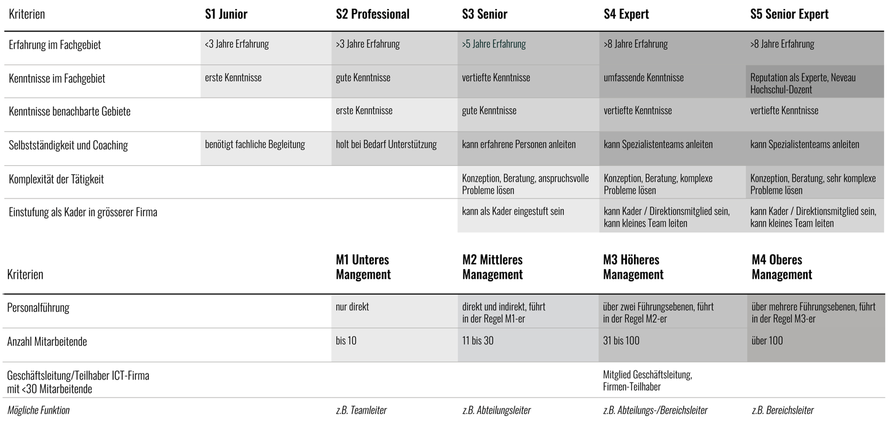

# Software Engineering Eduction

The intention is to port the content that currently exists (david riedo, marc sallin) from OneNote to this repo (Junior) and to create new content during the education of Jorge (Professional).

## Kompetenzstufen

